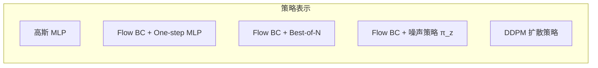
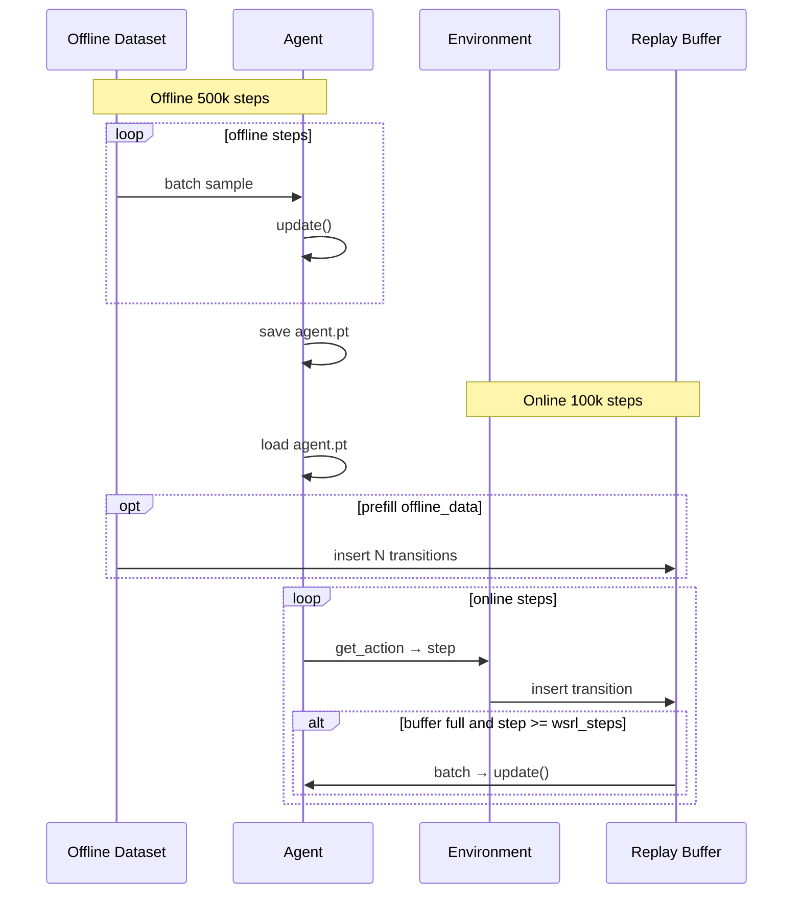

# CS285 Offline-to-Online：五个算法详解

本文档对应 `final_project_offline_online/problem/` 中的五个 agent，结合 [课程 PDF](https://rail.eecs.berkeley.edu/deeprlcourse/static/misc/offline_to_online_rl_default_final_project.pdf) 与你仓库里的实现，帮助你建立整体图景。

---

## 目录

1. [共同背景](#1-共同背景)
2. [总览对比](#2-总览对比)
3. [SAC+BC](#3-sacbc)
4. [FQL](#4-fql)
5. [IFQL](#5-ifql)
6. [DSRL](#6-dsrl)
7. [QSM](#7-qsm)
8. [Offline → Online 训练](#8-offline--online-训练)
9. [常见易错点](#9-常见易错点)

---

## 1. 共同背景

### 1.1 问题设定

- **离线阶段**：只能从固定数据集 \(\mathcal{D}\) 采样 \((s, a, r, s', done)\)，不与环境交互。
- **在线阶段**：加载离线 checkpoint，用 agent 在环境里 `step()`，数据写入 replay buffer，继续 `update()`。
- **动作空间**：连续，范围 \([-1, 1]\)（环境前会 tanh / clamp）。

### 1.2 几乎每个算法都有的组件

| 组件 | 作用 |
|------|------|
| **Twin Q（ensemble=2）** | \(Q_{\theta_1}, Q_{\theta_2}\)，输入 \((s,a)\)，输出标量 |
| **Target Q** | \(\bar{Q}\)，Polyak 软更新，算 Bellman target 用 |
| **折扣 \(\gamma\)** | 默认 0.99 |
| **Target update rate \(\tau\)** | 默认 0.005，\(\bar\theta \leftarrow \tau\theta + (1-\tau)\bar\theta\) |

**Ensemble 聚合方式（非常重要，各算法不同）：**

| 算法 | Q target 里对 ensemble 用 |
|------|---------------------------|
| SAC+BC, FQL, DSRL | **mean**（PDF 公式里对两个 \(\bar{Q}_j\) 取平均） |
| IFQL value 更新 | **min**（对 target critic） |
| QSM critic 更新 | **min**（保守 bootstrap） |
| QSM actor 里算 \(\nabla_a Q\) | **mean** |

### 1.3 一个 training step 的通用模式

```text
batch ← dataset 或 replay_buffer
metrics ← agent.update(s, a, r, s', done)
每步末尾：软更新 target 网络
```

---

## 2. 总览对比



| 算法 | 策略怎么表示 | 怎么从策略里拿动作（eval） | 核心思想 |
|------|-------------|---------------------------|----------|
| **SAC+BC** | 高斯 + tanh | **mode**（确定性） | SAC 最大化 Q + BC 拉住数据分布 |
| **FQL** | Flow 模仿 + 单步网络 \(\pi_\omega\) | **sample** \(\pi_\omega(s,z)\) | Q 学习用 one-step；改进策略不反传过 flow |
| **IFQL** | Flow 模仿 | **Best-of-N** 选 Q 最高 | IQL 的 \(V\) bootstrap + flow BC + rejection sampling |
| **DSRL** | Flow BC + 潜空间噪声策略 | sample \(z\) → flow 得 \(a\) | 在噪声空间做 SAC，动作空间做 BC flow |
| **QSM** | DDPM 预测噪声 \(\epsilon\) | DDPM 反向去噪 sample | 让预测噪声对齐 \(\nabla_a Q\)（Q-score matching） |

| 算法 | 主要超参 |
|------|----------|
| SAC+BC | `alpha`（BC 系数） |
| FQL | `alpha`（蒸馏系数） |
| IFQL | `expectile` \(\tau\)（0.85–0.95） |
| DSRL | `noise_scale` \(\sigma_z\)（0.8, 1.0, 1.2） |
| QSM | `alpha`（DDPM BC 权重）, `inv_temp` \(\eta\)（Q 梯度温度） |

**代码位置：**

| 算法 | Agent | Config |
|------|-------|--------|
| SAC+BC | `src/agents/sacbc_agent.py` | `src/configs/sacbc_config.py` |
| FQL | `src/agents/fql_agent.py` | `src/configs/fql_config.py` |
| IFQL | `src/agents/ifql_agent.py` | `src/configs/ifql_config.py` |
| DSRL | `src/agents/dsrl_agent.py` | `src/configs/dsrl_config.py` |
| QSM | `src/agents/qsm_agent.py` | `src/configs/qsm_config.py` |

---

## 3. SAC+BC

### 3.1 直觉

离线 RL 最怕策略跑到数据集没覆盖的动作上，critic 乱估 Q。SAC+BC 的做法：

- 用 **Q-learning** 告诉策略「什么好」
- 用 **BC 正则** 告诉策略「别离数据太远」
- 用 **熵** 保持一定随机性

这是 Part I 的 baseline，和 HW5 几乎相同。

### 3.2 网络结构

```text
Actor π_φ(a|s)     → Policy（高斯 + tanh）
Critic Q_θ(s,a)    → EnsembleCritic × 2（在线 + target）
Beta β             → LogParam（可学习熵系数）
```

### 3.3 损失函数

**Critic（Bellman）：**

\[
y = r + \gamma(1-d) \cdot \frac{1}{2}\sum_{j=1}^{2} \bar{Q}_j(s', a'), \quad a' \sim \pi(\cdot|s')
\]

\[
\mathcal{L}_Q = \sum_{i=1}^{2} \mathbb{E}\left[(Q_{\theta_i}(s,a) - y)^2\right]
\]

注意：
- bootstrap 用 **当前 actor** 采 \(a'\)，不是数据里的动作
- target 用 **mean**，不是 min
- **没有** SAC 原版的 entropy 项在 Bellman 里（离线 RL 常见改法）

**Actor：**

\[
\mathcal{L}_\pi = \mathbb{E}\left[ -\frac{1}{2}\sum_i Q_{\theta_i}(s, a_\pi) + \alpha \|a - a_\pi\|^2 + \beta \log\pi(a_\pi|s) \right]
\]

- 第一项：最大化 Q
- 第二项：BC，\(\alpha\) 是**固定超参**（要调）
- 第三项：熵正则，\(\beta\) **可学习**

**Beta（熵系数对偶更新）：**

\[
\mathcal{L}_\beta = \beta \cdot \mathbb{E}\left[-\log\pi(a_\pi|s) - \bar{H}\right], \quad \bar{H} = -|A|/2
\]

### 3.4 Eval 怎么取动作

```python
# sacbc_agent.py — 取高斯分布的 mode，再 tanh
action = self.actor(obs).base_dist.base_dist.mode.tanh()
```

**确定性**，不是 sample。

### 3.5 每步 update 顺序

```text
update_q → update_actor → update_beta → update_target_critic
```

---

## 4. FQL

**Flow Q-Learning**：把 SAC+BC 的高斯策略换成 **flow policy**，但 Q 最大化**不**直接反传过 flow（避免 BPTT）。

### 4.1 三个网络，各干什么

```text
bc_actor (v_θ)      → 向量场，flow matching 模仿数据（纯 BC）
onestep_actor (π_ω) → 普通 MLP： (s, z) → a，负责被 Q 优化
critic Q_φ          → 和 SAC+BC 一样
```

关系图：

```mermaid
flowchart TB
    z[噪声 z ~ N(0,I)]
    bc[bc_actor: ODE 积分 flow_steps 步]
    one[onestep_actor: 一步映射]
    Q[critic Q(s,a)]

    z --> bc
    z --> one
    bc -->|蒸馏目标| one
    one -->|clamp 后| Q
```

### 4.2 损失函数

**BC flow（模仿数据）：**

采样 \(t \sim U[0,1]\), \(z \sim \mathcal{N}(0,I)\), \(\tilde{a} = (1-t)z + ta\)

\[
\mathcal{L}_v = \mathbb{E}\|v(s,\tilde{a},t) - (a-z)\|^2
\]

**Critic：**

\[
y = r + \gamma(1-d) \cdot \frac{1}{2}\sum_j \bar{Q}_j(s', \text{clamp}(\pi_\omega(s',z)))
\]

\[
a' = \pi_\omega(s', z), \quad z \sim \mathcal{N}(0,I)
\]

关键：**bootstrap 用 one-step actor，不是 bc_actor**。

**One-step actor：**

\[
\mathcal{L}_{\pi_\omega} = \mathbb{E}\left[ -\frac{1}{2}\sum_i Q_i(s, \text{clamp}(\pi_\omega)) + \alpha \|\pi_\omega(s,z) - \pi_v(s,z)\|^2 \right]
\]

- \(\pi_v\)：用 `get_bc_action` 对 bc flow 做 Euler 积分得到，**stop gradient**
- 蒸馏 loss 不 clip；送 critic 的 action **要 clip** 到 \([-1,1]\)

### 4.3 Flow 积分（Euler）

从 \(t=0\)（纯噪声）积到 \(t=1\)（动作）：

```python
action = noise
for i in range(flow_steps):
    t = i / flow_steps
    action += bc_actor(s, action, t) * (1 / flow_steps)
action = clamp(action, -1, 1)
```

### 4.4 Eval

```python
# 从 one-step actor sample，不是 mode
action = onestep_actor(s, randn)
action = clamp(action, -1, 1)
```

### 4.5 每步 update 顺序

```text
update_q → update_bc_actor → update_onestep_actor → update_target_critic
```

### 4.6 和 SAC+BC 的对比

| | SAC+BC | FQL |
|--|--------|-----|
| 策略 | 单层高斯 | Flow BC + one-step |
| Q bootstrap 的 \(a'\) | actor sample | one-step actor |
| BC 方式 | MSE 在动作上 | Flow matching + 蒸馏 |
| Eval | mode | sample |

---

## 5. IFQL

**Implicit Flow Q-Learning**：IQL 的 flow 版本 + **Best-of-N rejection sampling**。

### 5.1 和 IQL 的关系

IQL 核心：学 \(V(s)\)，用 expectile regression，Q 的 bootstrap **不需要**从 actor 采 \(a'\)：

\[
y = r + \gamma V(s')
\]

IFQL 把 IQL 的 actor（AWR）换成 **flow BC**，eval 时用 **rejection sampling** 选动作。

### 5.2 网络结构

```text
flow_actor   → VectorFieldPolicy（flow matching BC）
critic Q     → ensemble × 2 + target
value V      → 只输入 s，输出标量
```

**没有**单独的「改进策略」网络；策略改进发生在 **eval 时的 best-of-N**。

### 5.3 损失函数

**Value（expectile regression）：**

\[
\mathcal{L}_V = \mathbb{E}\left[\ell_\tau^2\left(V(s) - \min_{i=1,2} \bar{Q}_i(s,a)\right)\right]
\]

Expectile loss：

\[
\ell_\tau^2(x) = |\tau - \mathbb{1}(x>0)| \cdot x^2
\]

\(\tau\) 接近 1 时，\(V\) 更像在拟合 Q 的**上分位**（乐观），这是 IQL 能 offline 工作的关键。

**Critic：**

\[
\mathcal{L}_Q = \sum_i \mathbb{E}\left[(Q_{\theta_i}(s,a) - r - \gamma V(s'))^2\right]
\]

**Actor（flow BC，和 FQL 的 bc 部分一样）：**

\[
\mathcal{L}_\pi = \mathbb{E}\|v(s,\tilde{a},t) - (a-z)\|^2
\]

### 5.4 Best-of-N / Rejection Sampling（仅 eval）

```text
对每个状态 s：
  for j = 1..N:
      z_j ~ N(0,I)
      a_j = flow_integrate(s, z_j)    # Euler
  j* = argmax_j  min_i Q_i(s, a_j)   # 注意用 min over ensemble
  return a_{j*}
```

代码：`sample_actions()` → `get_action()`。

### 5.5 每步 update 顺序

```text
update_value → update_q → update_actor(flow BC) → update_target_critic
```

### 5.6 和 FQL 的关键区别

| | FQL | IFQL |
|--|-----|------|
| Bootstrap | \(a'\) 来自 one-step actor | 用 \(V(s')\)，不要 \(a'\) |
| 策略改进 | one-step 网络最大化 Q | eval 时 best-of-N |
| 额外网络 | onestep_actor | value 网络 |
| 主要超参 | alpha | expectile \(\tau\) |

---

## 6. DSRL

**Diffusion-Space RL**（本作业按 QAM 扩展版）：**在潜噪声空间 \(z\) 做 RL**，用 **BC flow** 把 \(z\) 映射成动作 \(a\)。

### 6.1 核心思想

```text
传统：π(a|s) 直接输出动作
DSRL：π_z(z|s) 输出噪声 z  →  BC flow(s, σ_z·z) → 动作 a
```

RL 优化的是 **\(z\) 从哪来**，flow 负责「噪声 → 动作」的确定性映射。

### 6.2 网络结构

```text
bc_flow_actor (+ target)  → flow matching，学 π^BC(a|s)
noise_actor π_z         → 高斯策略，输出 z
critic Q(s,a)           → 动作空间 Q（ensemble + target）
z_critic Q_z(s,z)       → 噪声空间 Q（ensemble）
log_alpha               → SAC 可学习熵系数
```

### 6.3 动作怎么生成

```text
z ~ π_z(·|s)
a = Euler_integrate(target_bc_flow, s, σ_z · z)
a = clamp(a, -1, 1)
```

**Eval 和训练 bootstrap 都用 `sample_actions()`**；flow 积分用 **target** bc flow。

### 6.4 损失函数

**\(Q(s,a)\) — 标准 TD：**

\[
y = r + \gamma(1-d) \cdot \frac{1}{2}\sum_j \bar{Q}_j(s', a'), \quad a' \sim \pi^{BC}(\bar\phi; s', \sigma_z z')
\]

**\(Q_z(s,z)\) — 蒸馏（不是 Bellman）：**

\[
y_z = \frac{1}{2}\sum_j Q_{\bar\theta_j}(s, a^{BC}), \quad a^{BC} = \text{flow}(s, \sigma_z z)
\]

\[
\mathcal{L}_{Q_z} = \mathbb{E}\left[(Q_z(s, \sigma_z z) - y_z)^2\right]
\]

训练中 `noises = randn_like(actions)` 作为 \(z\) 样本。

**BC flow：**

与 FQL/IFQL 相同的 flow matching loss。

**Noise actor（SAC primal）：**

\[
\mathcal{L}_{\pi_z} = \mathbb{E}\left[\alpha \log\pi_z(z|s) - Q_z(s, \sigma_z z)\right]
\]

用 `rsample()` + `alpha.detach()`。

**Alpha（SAC dual）：**

\[
\mathcal{L}_\alpha = \alpha \cdot \mathbb{E}\left[-\log\pi_z - H_{\text{target}}\right], \quad H_{\text{target}} = -|A|
\]

### 6.5 每步 update 顺序

```text
update_q
update_qz          # 用随机 z 蒸馏
update_actor       # BC flow
update_noise_actor
update_alpha
update_target_critic
update_target_bc_flow_actor
```

### 6.6 超参 \(\sigma_z\)

缩放 noise policy 输出的 \(z\)：`noise_scale` in config。影响 flow 输入幅度，需要 per-task 调。

---

## 7. QSM

**Q-Score Matching**：策略是 **DDPM 扩散模型**，训练时让网络预测的噪声 \(\epsilon\) 对齐 **\(\nabla_a Q\)** 方向。

### 7.1 和 Flow / 高斯的区别

| | Flow (FQL/IFQL) | DDPM (QSM) |
|--|-----------------|------------|
| 生成过程 | ODE：噪声 → 动作（确定性积分） | 随机去噪：\(x_T \sim \mathcal{N}\) 逐步 denoise |
| 网络输出 | 速度场 \(v(s,a,t)\) | 噪声 \(\epsilon(s, \tilde{a}_t, t)\) |
| 训练目标 | Flow matching | QSM loss + DDPM BC loss |

### 7.2 噪声 schedule

Cosine schedule（Nichol & Dhariwal）：

```text
β_t, α_t = 1-β_t,  α̂_t = ∏ α
存在 agent 的 buffer：betas, alphas, alpha_hats
```

### 7.3 前向扩散（训练时加噪）

随机时间步 \(t \sim U\{0,\ldots,T-1\}\), \(z \sim \mathcal{N}(0,I)\):

\[
\tilde{a}_t = \sqrt{\hat\alpha_t}\, a + \sqrt{1-\hat\alpha_t}\, z
\]

### 7.4 损失函数

**Critic：**

\[
y = r + \gamma(1-d) \cdot \min_i \bar{Q}_i(s', a'), \quad a' \sim \text{DDPM\_sample}(s')
\]

注意 QSM 这里用 **min**（保守），和 SAC+BC/FQL 的 mean 不同。

**Actor：**

\[
\mathcal{L}_\pi = \mathbb{E}\|\,-\epsilon_\phi(s,\tilde{a}_t,t) - \eta \nabla_{\tilde{a}_t} Q(s,\tilde{a}_t)\,\|^2 + \alpha \mathbb{E}\|z - \epsilon_\phi(s,\tilde{a}_t,t)\|^2
\]

- 第一项 **QSM loss**：预测噪声要指向 Q 上升方向（\(\eta\) = `inv_temp`）
- 第二项 **DDPM BC loss**：常规去噪模仿，\(\alpha\) 平衡两项

算 Q 梯度时：\(\tilde{a}_t\) detach 后 `requires_grad_(True)`，对 `target_critic.mean` 求 \(\nabla_a Q\)。

### 7.5 DDPM 采样（eval + Q bootstrap）

```text
x = z ~ N(0,I)
for t = T-1 ... 0:
    ε_pred = actor(s, x, t)
    x = (1/√α_t) * (x - ((1-α_t)/√(1-α̂_t)) * ε_pred)
    if t > 0: x += √β_t * noise
return clamp(x, -1, 1)
```

### 7.6 每步 update 顺序

```text
update_q → update_actor → update_target_critic
```

`update_actor` 不能用 `@torch.compile`（要 autograd.grad 算 Q 梯度）。

---

## 8. Offline → Online 训练

脚本：`src/scripts/train_offline_online.py`



### Part II 两个技巧（基于 FQL）

| 技巧 | 参数 | 做法 |
|------|------|------|
| **Offline data retention** | `--offline_data N` | 在线开始前，从离线 dataset 抽 N 条放进 replay buffer |
| **WSRL** | `--wsrl_steps N` | 前 N 步只与环境交互、不 `update()`，先攒 on-policy 数据 |

---

## 9. 常见易错点

### 9.1 Ensemble 聚合

```text
SAC+BC / FQL / DSRL Q target  →  mean(dim=0)
IFQL value target             →  min(dim=0)
IFQL best-of-N                →  min(dim=0) 再 argmax
QSM Q target                  →  min(dim=0)
QSM actor 里 ∇Q               →  mean(dim=0)
```

### 9.2 Bootstrap 里「下一动作」从哪来

| 算法 | \(a'\) 或 bootstrap 来源 |
|------|--------------------------|
| SAC+BC | `actor(next_s).sample()` |
| FQL | `onestep_actor(next_s, z)`，再 clamp |
| IFQL | 不需要 \(a'\)，用 `value(next_s)` |
| DSRL | `sample_actions(next_s)` = π_z + target flow |
| QSM | `ddpm_sampler(next_s, noise)` |

### 9.3 Eval 取动作方式

| 算法 | 方式 |
|------|------|
| SAC+BC | mode（确定性） |
| FQL | sample one-step |
| IFQL | best-of-N |
| DSRL | sample π_z + flow |
| QSM | DDPM sample |

### 9.4 设备（GPU）

所有 `torch.randn` / `torch.full` 要和 `observations.device` 一致，否则 GPU 训练会报 device mismatch。

### 9.5 Polyak 更新的是 target，不是 online 网络

```python
for p, tp in zip(critic.parameters(), target_critic.parameters()):
    tp.data.copy_(tau * p.data + (1 - tau) * tp.data)
```

### 9.6 关键超参敏感度

五个算法里 **`alpha` / `expectile` / `noise_scale` / `inv_temp`** 都强烈影响 offline 成功率，需要 per-environment 网格搜索。PDF 里给了每个环境的 sanity check 范围和目标 success rate。

---

## 附录：快速命令

```bash
cd final_project_offline_online/problem

# 纯离线（HW5 风格）
uv run src/scripts/run.py --base_config=sacbc --env_name=cube-single-play-singletask-task1-v0 --seed=0

# Offline + Online
uv run src/scripts/train_offline_online.py \
  --base_config=fql --env_name=cube-single-play-singletask-task1-v0 --seed=0 \
  --offline_training_steps=500000 --online_training_steps=100000 --alpha=100

# Part II 技巧
uv run src/scripts/train_offline_online.py --base_config=fql ... --offline_data=50000
uv run src/scripts/train_offline_online.py --base_config=fql ... --wsrl_steps=10000
```

---

*文档生成自 CS285 Spring 2026 Final Project starter code 与官方 PDF。若公式与 PDF 冲突，以 PDF 为准。*
