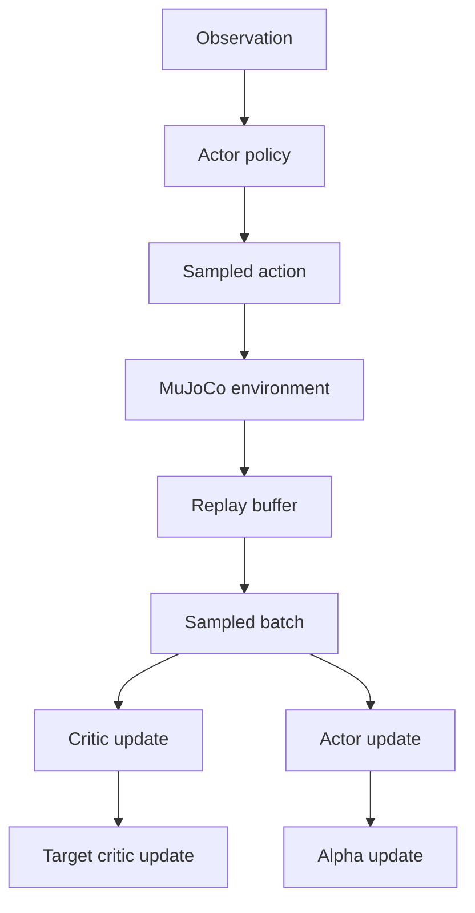

# Day 1: SAC Mental Model

Goal: build one clean picture of what SAC is doing before worrying about every line.

## The four objects

### 1. Actor / policy
The actor takes a state `s` and outputs a distribution over continuous actions:

```python
pi(a | s)
```

In this codebase, the actor lives in:
- `src/networks/policies.py`
- `src/agents/sac_agent.py` via `self.actor`

Its jobs are:
- produce actions for environment interaction
- produce differentiable sampled actions during actor update
- provide `log_prob(action)` for the entropy term

### 2. Critic
The critic estimates:

```python
Q(s, a)
```

This is "how good is action `a` at state `s` if I continue following the current policy?"

In this codebase:
- `src/networks/critics.py` defines `StateActionCritic`
- `src/agents/sac_agent.py` wraps one or more critics using `self.critics`

### 3. Target critic
The target critic is a slowly updated copy of the critic.

Its only purpose is to make Bellman targets less unstable.

Without it, the critic would try to fit a target that is moving too aggressively.

### 4. Temperature `alpha`
Temperature controls the tradeoff between:
- choosing actions with high Q values
- staying stochastic enough to explore

You can think of it as an "exploration pressure" knob.

If `alpha` is bigger:
- the policy is encouraged to stay more random

If `alpha` is smaller:
- the policy becomes more greedy with respect to Q

## The two formulas to memorize

### Critic target

```python
target_q = r + gamma * (Q_target(s', a') - alpha * log pi(a'|s'))
```

Interpretation:
- `r`: immediate reward
- `gamma * (...)`: discounted future value
- `Q_target(s', a')`: what the next state-action pair is worth
- `- alpha * log pi(a'|s')`: entropy bonus written in log-prob form

Because `log pi(a'|s')` is usually negative, subtracting it adds exploration value.

### Actor objective

```python
actor_loss = E[alpha * log pi(a|s) - Q(s, a)]
```

Interpretation:
- make `Q(s, a)` large
- but do not collapse the policy too early into a deterministic action

The actor is not trying to copy the best action directly. It is trying to become a high-value stochastic policy.

## Where each piece lives in your code

- `get_action()` in `src/agents/sac_agent.py`
  - sampling action for environment interaction
- `update_critic()`
  - building Bellman targets and fitting Q
- `q_backup_strategy()`
  - combining multiple critics by `mean` or `min`
- `actor_loss_reparametrize()`
  - sampling a differentiable action and building actor loss
- `update_actor()`
  - one gradient step on the actor
- `update_alpha()`
  - automatic temperature tuning

## Data flow in one training step



## Division of responsibility

### `run_sac.py` is responsible for:
- environment creation
- replay buffer insertion
- choosing when to start training
- sampling mini-batches
- calling `agent.update(...)`
- logging evaluation metrics

### `sac_agent.py` is responsible for:
- computing losses
- doing backprop
- updating critic, actor, target critic, and alpha

## The one-sentence mental model

SAC learns a continuous-control policy by fitting Q-values off-policy, then improving a stochastic actor to choose actions that are both high-value and still exploratory.

## Day 1 self-check

If you can answer these without opening code, Day 1 is complete:
- What does the actor output: a value, a Q table, or a distribution?
- Why do we need a target critic?
- Why is entropy part of SAC at all?
- Which file owns environment interaction, and which file owns gradients?
